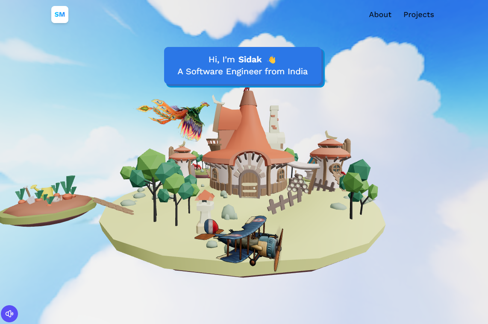

Great! Given that you've used Three.js, React, Vite, and Tailwind CSS, here's a modified README template specifically tailored to these technologies:

````markdown
# 3D Portfolio Project



## Overview

Welcome to my 3D portfolio project! This project showcases my skills in 3D modeling, animation, and interactive design, built using Three.js, React, Vite, and styled with Tailwind CSS. Explore a dynamic and visually appealing portfolio that reflects my creativity and technical expertise in the world of 3D graphics.

## Table of Contents

- [Features](#features)
- [Demo](#demo)
- [Installation](#installation)
- [Usage](#usage)
- [Technologies Used](#technologies-used)
- [Contributing](#contributing)
- [License](#license)
- [Contact](#contact)

## Features

- **Interactive 3D Models:** Explore a collection of interactive 3D models, seamlessly integrated with the power of Three.js.

- **Animations:** Engage with captivating animations that leverage React components for a dynamic and responsive experience.

- **Vite for Speed:** The project is built using Vite for fast development and optimized production builds.

- **Tailwind CSS Styling:** Enjoy a visually appealing and responsive design with Tailwind CSS utility-first classes.

## Demo

Include a link to a live demo of your 3D portfolio project or embed a video showcasing its features. You can use platforms like GitHub Pages, Netlify, or Vercel for hosting.

[View Demo](https://your-portfolio-demo-link.com)

## Installation

Follow these steps to set up the project locally:

1. Clone the repository: `git clone https://github.com/SidakMarwah/your-3d-portfolio.git`
2. Navigate to the project directory: `cd 3d-portfolio`
3. Install dependencies: `npm install`

## Usage

To run the project locally, use the following command:

```bash
npm run dev
```
````

Visit [http://localhost:3000](http://localhost:3000) in your browser to explore the 3D portfolio.

## Technologies Used

- **Three.js:** A popular JavaScript library for creating 3D graphics in the browser.
- **React:** Used for building the interactive user interface with reusable components.
- **Vite:** A fast, modern frontend build tool that optimizes for speed and efficiency.
- **Tailwind CSS:** A utility-first CSS framework for styling with ease.

## Contributing

If you'd like to contribute to this project, please follow our [Contribution Guidelines](CONTRIBUTING.md). All contributions are welcome!

## License

This project is licensed under the [MIT License](LICENSE).

## Contact

Feel free to reach out to me if you have any questions or feedback:

- Email: your.email@example.com
- Portfolio: [yourportfolio.com](https://yourportfolio.com)
- LinkedIn: [linkedin.com/in/sidak-marwah-bb3626259](https://www.linkedin.com/in/sidak-marwah-bb3626259/)

```

```
